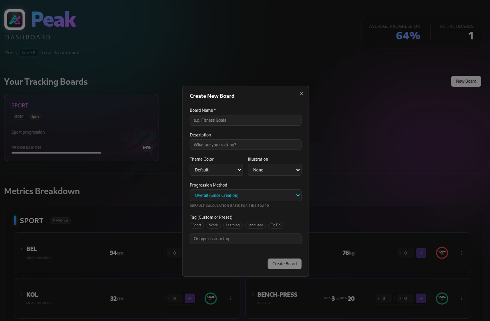
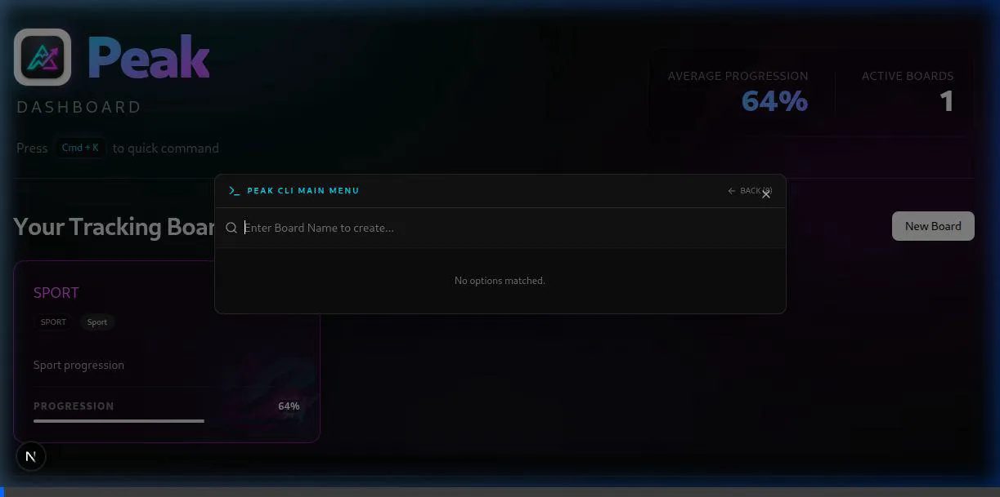
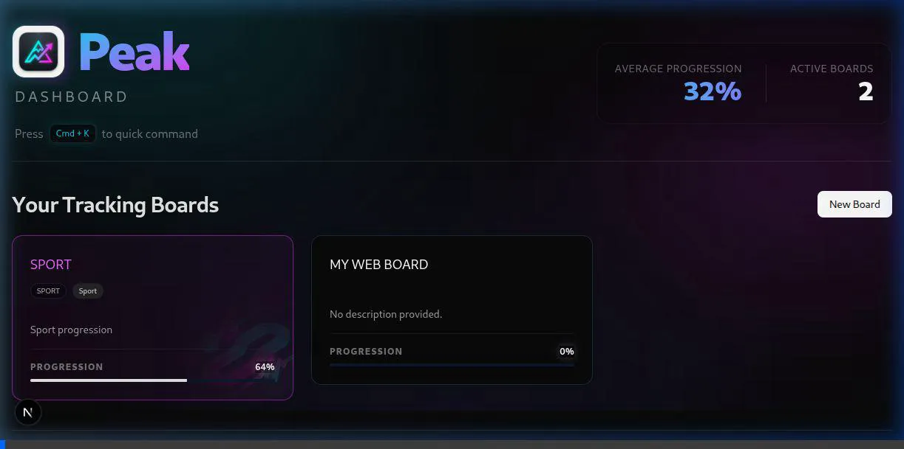

# 🏔️ Peak: Universal Progress Tracking Engine

Peak is a unified, high-performance tracking system designed for individuals who value data-driven growth. It seamlessly bridges the gap between deep **CLI efficiency** and a stunning **Web Dashboard** experience.



---

## 🚀 Installation & Setup

Peak is cross-platform and provides automated scripts for a "one-click" setup.

### 📋 Prerequisites
- **Node.js**: v20 or higher.
- **Git**: For version control.
- **Database**: PostgreSQL (Ensure your connection string is configured).

### 🐧 Linux & 🍎 macOS
1. Open your terminal in the project root.
2. Grant execution permission: `chmod +x scripts/setup.sh`
3. Run the setup: `./scripts/setup.sh`
4. **Global Access**: The script will attempt to link `peak` to your `/usr/local/bin`. You may be prompted for your password.

### 🪟 Windows
1. Open Command Prompt (CMD) as **Administrator**.
2. Run the setup script: `scripts\setup.bat`
3. **Global Access**: Windows will register `peak` as a global command.

> [!TIP]
> After installation, simply type `peak` in any new terminal window to verify the installation.

---

## 💻 CLI Usage Guide

The Peak CLI (Command Line Interface) is built using a robust **MVC architecture**, optimized for speed and clarity.

### 1. Interactive Mode (Recommended)
Simply type `peak` to enter the interactive wizard. This mode guides you through:
- Creating and deleting boards.
- Adding metrics with specific schemas.
- Logging new values with intelligent prompts.
- **Launch Dashboard**: Directly opens your web browser (and starts the server if needed).

### 2. Direct Commands
For power users, direct commands allow for rapid operations:

| Command | Description |
| :--- | :--- |
| `peak board create [name]` | Create a new board. |
| `peak board delete [name]` | Remove a board (Interactive selection if name omitted). |
| `peak board report <bname>` | Generate a visual ASCII progress report. |
| `peak board add-metric <bname> <mname>` | Launch the metric creation wizard for a board. |
| `peak board set-value <bname> <mname>` | Log a new value with immediate performance feedback. |
| `peak dashboard` | Open the web interface (Checks/Starts server automatically). |

---

## 🌐 Web Dashboard Guide

A premium Next.js dashboard designed for visual clarity and rapid interaction.

### ⌨️ The Quick Menu (Cmd + K)
Navigate your entire universe without touching the mouse:
- **Board Navigation**: Fuzzy search through all your boards.
- **In-Context Actions**: Once a board is selected, the menu updates to show:
  - Add Metric
  - Log Value
  - Delete Metric
- **Quick Switch**: Jump between different boards in milliseconds.

**Creating a Board via Quick Menu:**


**Navigating & Viewing Reports:**


### 📊 Visual Progress Report
Every board features a comprehensive view of your growth:
- **Daily Aggregations**: Visualize your consistency.
- **Performance Trends**: See your progress (e.g., `+12.5%`) since creation or between the last two updates.
- **Smart Metric Rendering**: From simple counters to complex `Set x Rep` logs, Peak renders every data point beautifully.

---

## 🏗️ Architecture & Features

Peak is built on **SOLID** principles, ensuring it's easy to extend and maintain.

- **MVC Core**: Separation of concerns between CLI logic, domain services, and data persistence.
- **Intelligent Server Management**: The CLI can detect if the web server is running and offer to start it in the background.
- **Cross-Platform Robustness**: Dedicated setup handling for Arch Linux, Ubuntu, macOS, and Windows.

---

## 🧪 Deployment & Development

### 🚀 Deploy to Vercel
Peak is ready to be deployed on Vercel with zero configuration. Click the button below to deploy your own instance:

[](https://vercel.com/new/clone?repository-url=https%3A%2F%2Fgithub.com%2FgkhanC%2FPeak&project-name=peak-dashboard&framework=nextjs)

### 🛠️ Manual Build
If you wish to build the monorepo from scratch:
```bash
npm run build
```

### 🏃 Running Locally
Start both the API and the Web client:
```bash
npm run dev
```

---

## 📄 License
Peak is licensed under the **MIT License**.
